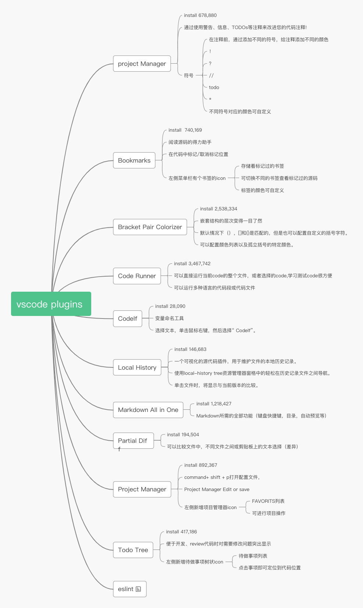

# Better development experience of vscode

开发工具众多，自己喜欢的才是最好的，我比较钟爱vscode，为了让开发体验更爽，我一直在寻找使之更上一层楼的路上

1. project Manager
    1. install 678,880
    2. 通过使用警告、信息、TODOs等注释来改进您的代码注释!
    3. 符号
       1. 在注释前，通过添加不同的符号，给注释添加不同的颜色
       2. ！
       3. ？
       4. //
       5. @
       6. *
       7. 不同符号对应的颜色可自定义

2. Bookmarks
   1. install  740,169
   2. 阅读源码的得力助手
   3. 在代码中标记/取消标记位置
   4. 左侧菜单栏有个书签的icon
      1. 存储着标记过的书签
      2. 可切换不同的书签查看标记过的源码
      3. 标签的颜色可自定义

3. Bracket Pair Colorizer
   1. install 2,538,334
   2. 嵌套结构的层次变得一目了然
   3. 默认情况下（），[]和{}是匹配的，但是也可以配置自定义的括号字符。
   4. 可以配置颜色列表以及孤立括号的特定颜色。

4. Code Runner
   1. install 3,467,742
   2. 可以直接运行当前code的整个文件，或者选择的code,学习测试code很方便
   3. 可以运行多种语言的代码段或代码文件

5. Codelf
   1. install 28,090
   2. 变量命名工具
   3. 选择文本，单击鼠标右键，然后选择“ Codelf”。

6. Local History
   1. install 146,683
   2. 一个可视化的源代码插件，用于维护文件的本地历史记录。
   3. 使用local-history tree资源管理器窗格中的轻松在历史记录文件之间导航。
   4. 单击文件时，将显示与当前版本的比较

7. Markdown All in One
   1. install 1,218,427
   2. Markdown所需的全部功能（键盘快捷键，目录，自动预览等)

8. Partial Diff
   1. install 194,504
   2. 可以比较文件中，不同文件之间或剪贴板上的文本选择（差异）

9. Project Manager
   1. install 892,367
   2. command+ shift + p打开配置文件
   3. Project Manager Edit or save
   4. 左侧新增项目管理器icon
      1. FAVORITS列表
      2. 可进行项目操作

10. Todo Tree
    1. install 417,186
    2. 便于开发、review代码时对需要修改问题突出显示
    3. 左侧新增待做事项树状icon
       1. 待做事项列表
       2. 点击事项即可定位到代码位置
